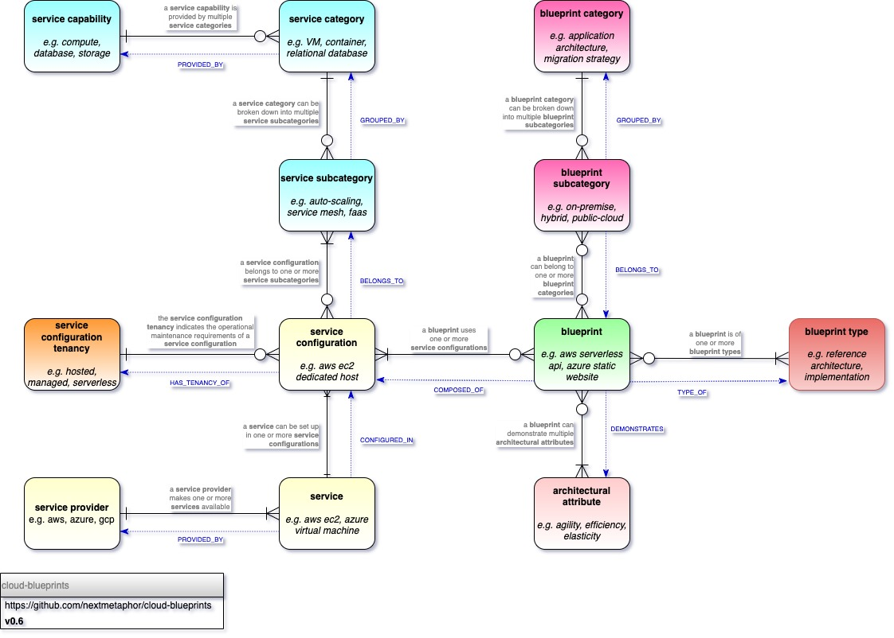

# cloud-blueprints
Cloud Computing Blueprints



Latest version can be found at [https://nextmetaphor.gitlab.io/cloud-blueprints/](https://nextmetaphor.gitlab.io/cloud-blueprints/)

```shell
# create a yaml-graph container mounting the report and definition directories
docker run -it -p7474:7474 -p7687:7687 -v $(PWD)/cloud-taxonomy/definition:/home/ymlgraph/taxonomy -v $(PWD)/cloud-architecture-frameworks/definition:/home/ymlgraph/frameworks -v $(PWD)/definition:/home/ymlgraph/blueprints -v $(PWD)/report:/home/ymlgraph/report nextmetaphor/yaml-graph

# validate the definitions
yaml-graph validate -s taxonomy -s frameworks -s blueprints -f taxonomy/definition-format.yml -f frameworks/definition-format.yml -f blueprints/definition-format.yml  

# load into the graph
yaml-graph load -s taxonomy -s frameworks -s blueprints 

# generate reports

# report by blueprint-category
yaml-graph report --fields report/by-blueprint-category/fields.yaml --template report/by-blueprint-category/template.gohtml > report/by-blueprint-category/by-blueprint-category.html

# blueprint by category (JSON)
yaml-graph report --fields report/BlueprintByCategoryJSON/fields.yaml --template report/BlueprintByCategoryJSON/template.gohtml > report/BlueprintByCategoryJSON/document.json
```